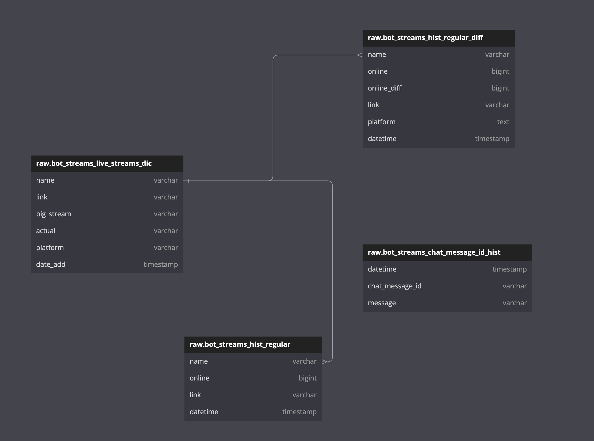
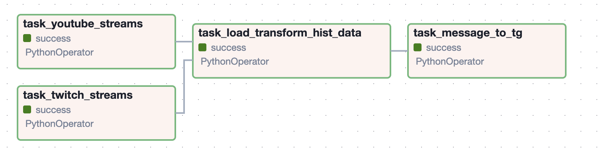
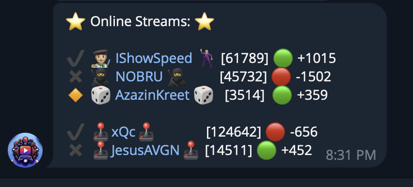

# Project Description: Telegram Bot for Stream Alerts

## General Information

This project features a Telegram bot designed to notify users about current live broadcasts on YouTube and Twitch platforms. The bot collects data on live streams, transforms it, loads it into a PostgreSQL database, and sends notifications to a Telegram channel. The ETL (Extract, Transform, Load) process is implemented using Apache Airflow, facilitating data automation and convenient management.

## Key Features

- **Data Collection**: The bot automatically gathers information about current live broadcasts on YouTube and Twitch.
- **Data Transformation**: The collected data is processed to generate statistics, including a 95% confidence interval over the last 15 days.
- **Database Loading**: Processed data is loaded into a PostgreSQL database for storage and further analysis.
- **Notification Sending**: The bot sends notifications on Telegram with information about the streamer's name, a link to their channel, current online status, online change (increase or decrease), and whether the stream exceeds the confidence interval or stays within its bounds.

## Libraries and Technologies Used

- **Apache Airflow**: Used for automating the ETL processes.
- **PostgreSQL**: The database for storing collected and processed data.
- **Telebot**: A Python library for developing Telegram bots, used for sending notifications.
- **Requests**: A Python library for making HTTP requests, used to collect data from YouTube and Twitch.
- **Pandas**: A Python library for data analysis, used for data transformation and processing.
- **SQLAlchemy**: A Python library for database interaction, used for communicating with PostgreSQL.

## ERD Diagram of the Database

## Apache Airflow Interface

Here is an example of the Apache Airflow interface with the tasks of the ETL process:

## Example of the Result

This is what a notification sent by the bot to the Telegram channel looks like:  

## Conclusion

This project allows real-time tracking of streamer activity on popular platforms and promptly notifies the audience about interesting broadcasts. The use of modern technologies and libraries makes the data management process flexible and efficient.

# Описание проекта: Телеграм-бот для оповещения о стримах

## Общая информация

Проект представляет собой телеграм-бота, предназначенного для оповещения пользователей о текущих онлайн-трансляциях на платформах YouTube и Twitch. Бот собирает данные об онлайн-трансляциях, трансформирует их, загружает в базу данных PostgreSQL и отправляет оповещения в телеграм-канал. Процесс ETL (Extract, Transform, Load) реализован с использованием Apache Airflow, что обеспечивает автоматизацию и удобное управление данными.

## Основные функции

- **Сбор данных**: Бот автоматически собирает информацию о текущих онлайн-трансляциях с YouTube и Twitch.
- **Трансформация данных**: Собранные данные обрабатываются для формирования статистики, включая доверительный интервал 95% за последние 15 дней.
- **Загрузка в базу данных**: Обработанные данные загружаются в базу данных PostgreSQL для хранения и дальнейшего анализа.
- **Отправка уведомлений**: Бот отправляет уведомления в телеграм с информацией о названии стримера, ссылке на его канал, текущем онлайне, изменении онлайна (растет или падает), а также показывает, выходит ли стрим за доверительный интервал или находится в его пределах.

## Используемые библиотеки и технологии

- **Apache Airflow**: Используется для автоматизации процессов ETL.
- **PostgreSQL**: База данных для хранения собранных и обработанных данных.
- **Telebot**: Библиотека для разработки телеграм-ботов на Python, используется для отправки уведомлений.
- **Requests**: Библиотека для отправки HTTP-запросов в Python, используется для сбора данных с YouTube и Twitch.
- **Pandas**: Библиотека для анализа данных в Python, используется для трансформации и обработки данных.
- **SQLAlchemy**: Библиотека для работы с базами данных в Python, используется для взаимодействия с PostgreSQL.

## ERD диаграмма базы данных

## Интерфейс Apache Airflow

Вот пример интерфейса Apache Airflow с задачами ETL процесса:

## Пример результата

Вот как выглядит оповещение, отправленное ботом в телеграм-канал:  

## Вывод

Данный проект позволяет в реальном времени отслеживать активность стримеров на популярных платформах и оперативно уведомлять аудиторию об интересующих трансляциях. Использование современных технологий и библиотек делает процесс управления данными гибким и эффективным.